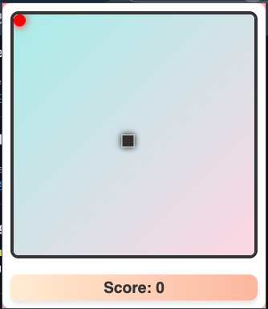

# Snake Game - Chrome Extension

Enjoy the classic Snake Game directly in your browser with this **Snake Game Chrome Extension**! This lightweight and interactive extension brings the nostalgic fun of Snake to your browser in a beautifully designed interface.



---

## Features

- 🎮 **Classic Gameplay**: Control the snake and try to eat the food to grow while avoiding collisions.
- ✨ **Modern UI**: Sleek gradient background, glowing food, and shadow effects for the snake.
- 🔥 **Responsive Design**: Works seamlessly across different screen sizes.
- 🚀 **Lightweight**: Minimal impact on your browser's performance.
- 🌐 **Offline Support**: Play anytime without an internet connection.

---

## How to Install

### From Source (For Developers):

1. Clone this repository:
   ```bash
   git clone https://github.com/Marcusleeleelee/chrome-extension-snake.git
   ```
2. Open Chrome and navigate to chrome://extensions.

3. Enable Developer Mode (top-right corner).

4. Click Load unpacked and select the project folder.

5. The Snake Game extension will appear in your toolbar.
